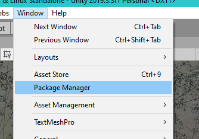
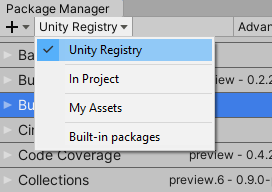
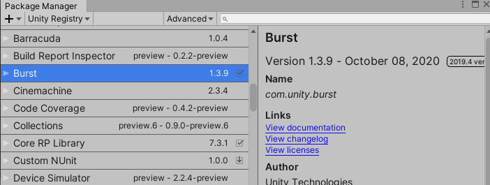

# Space Graphic Toolkit

## 참고자료 및 원본 문서

http://carloswilkes.com/Documentation/SpaceGraphicsToolkit

## 종류

유니티 에셋

---

## Space Graphics Toolkit을 사용해주셔서 감사합니다

아직 리뷰를 작성하지 않았다면 리뷰 작성을 고려해주세요! 리뷰는 제작자들에게 큰 도움이 됩니다.

SGT(Space Graphics Toolkit)은 인상적인 우주 장면을 만들기 위해 원하는 방식으로 결합할 수 있는 컴포넌트, 셰이더 및 그래픽 효과의 대규모 모음입니다.

이 에셋은 **Feature** 및 **Packs** 폴더로 분할되어 있습니다.

### Feature

Feature 폴더에는 특정 SGT 기능에 대한 대부분의 코드와 예제 씬이 포함되어 있습니다. 예를 들어, Atmosphere 폴더에는 컴포넌트와 셰이더가 포함되어 있어 행성에 대기를 추가할 수 있습니다.

### Packs

Packs 폴더에는 SGT 기능 그룹에 대한 대부분의 미디어 및 예제 씬이 포함되어 있습니다. 예를 들어, Alien Worlds Pack에는 외계 행성 텍스처, 머티리얼, 데모 씬등이 포함되어 있습니다.

---

## 필수 패키지

> NOTE - Terrain 기능을 사용하려면 Space Graphics Toolkit에서 Burst 패키지를 수동으로 설치해야 합니다.

이 패키지를 설치하려면 먼저 Package Manager 창을 열고 패키지 목록 다운로드가 완료될 때까지 기다립니다.

드롭다운을 클릭하고 Unity Registry를 선택하면 유니티의 모든 공식 패키지를 볼 수 있습니다.

